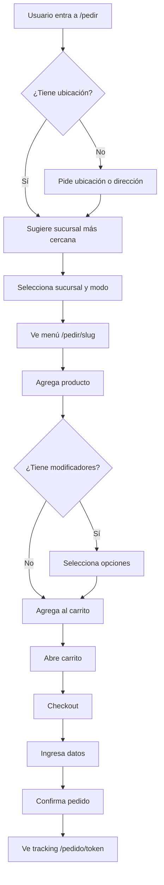

# DOCUMENTACIÓN COMPLETA - HOPPINESS HUB PLATFORM

**Fecha de generación:** Enero 2026  
**Versión:** 1.0

---

## 1. VISIÓN GENERAL

### Nombre de la Aplicación
**Hoppiness Hub Platform** (App Hoppiness)

### Propósito Principal y Problema que Resuelve
Plataforma integral de gestión gastronómica diseñada específicamente para la cadena de hamburguesas **Hoppiness**. Resuelve múltiples necesidades operativas:

1. **Gestión multi-sucursal centralizada** - Control de marca (catálogo, productos, modificadores) con autonomía operativa por local
2. **Sistema POS completo** - Punto de venta integrado con KDS (Kitchen Display System)
3. **E-commerce tipo delivery apps** - Experiencia de pedido online estilo PedidosYa/Rappi
4. **Gestión de RRHH** - Fichajes, horarios, liquidaciones, control de personal
5. **Control financiero** - Caja, transacciones, proveedores, facturación electrónica
6. **Gestión de inventario** - Stock, ingredientes, recetas, CMV

### Público Objetivo
| Rol | Descripción |
|-----|-------------|
| **Administradores de marca** | Gestión centralizada del catálogo, precios, reportes globales |
| **Socios/Franquiciados** | Acceso a reportes financieros de sus locales |
| **Encargados de sucursal** | Operación diaria, RRHH, stock, finanzas del local |
| **Cajeros/Operativos** | Uso de POS, KDS, toma de pedidos |
| **Clientes finales** | Pedidos online (delivery/takeaway) |

### Propuesta de Valor Única
- **Mono-marca, multi-sucursal**: A diferencia de marketplaces, solo existe Hoppiness
- **Catálogo centralizado ("Mi Marca")** con disponibilidad local ("Mi Local")
- **Sistema de modificadores robusto**: Adicionales, personalizaciones, combos
- **Integración completa**: POS + eCommerce + Finanzas + RRHH en una sola plataforma
- **Preparado para franquicias**: Arquitectura de permisos granulares por sucursal

---

## 2. ARQUITECTURA TÉCNICA

### Stack Tecnológico

| Capa | Tecnología |
|------|------------|
| **Frontend** | React 18.3.1 + TypeScript |
| **Routing** | React Router DOM 6.30.1 |
| **Styling** | Tailwind CSS + tailwindcss-animate |
| **UI Components** | shadcn/ui (Radix UI primitives) |
| **State Management** | TanStack Query 5.83.0 |
| **Backend** | Lovable Cloud (Supabase) |
| **Database** | PostgreSQL con RLS nativo |
| **Auth** | Supabase Auth |
| **Storage** | Supabase Storage |
| **Functions** | Supabase Edge Functions (Deno) |
| **Build Tool** | Vite |
| **Testing** | Vitest |

### Frameworks y Librerías Principales

```json
{
  "UI/UX": [
    "@radix-ui/* (accordion, dialog, dropdown, popover, etc.)",
    "lucide-react (iconos)",
    "sonner (toasts)",
    "vaul (drawers)",
    "cmdk (command palette)",
    "framer-motion (animaciones - implícito)"
  ],
  "Forms": [
    "react-hook-form",
    "@hookform/resolvers",
    "zod (validación)"
  ],
  "Data": [
    "@tanstack/react-query",
    "@supabase/supabase-js"
  ],
  "Utilidades": [
    "date-fns (fechas)",
    "xlsx (exportación Excel)",
    "qrcode.react (códigos QR)",
    "recharts (gráficos)",
    "class-variance-authority + clsx + tailwind-merge"
  ],
  "Maps": [
    "@react-google-maps/api"
  ],
  "Drag & Drop": [
    "@dnd-kit/core, @dnd-kit/sortable, @dnd-kit/modifiers"
  ]
}
```

### Estructura de Carpetas

```
src/
├── assets/                    # Imágenes estáticas (logos, hero images)
├── components/
│   ├── admin/                 # Componentes panel administración
│   ├── attendance/            # Fichajes y control de asistencia
│   ├── charts/                # Gráficos y visualizaciones
│   ├── dashboard/             # Widgets de dashboard
│   ├── guards/                # Route guards (RequireAuth, RequireAdmin, etc.)
│   ├── hr/                    # Recursos Humanos
│   ├── layout/                # Headers, footers, sidebars
│   ├── maps/                  # Mapas y zonas de delivery
│   ├── orders/                # Componentes de pedidos
│   ├── pos/                   # Componentes POS y KDS
│   ├── reports/               # Reportes y análisis
│   ├── schedules/             # Horarios
│   ├── store/                 # Tienda online (modificadores, etc.)
│   └── ui/                    # Componentes shadcn/ui base
├── contexts/                  # React contexts
├── hooks/                     # Custom hooks
├── integrations/supabase/     # Cliente y tipos de Supabase
├── lib/                       # Utilidades (utils.ts, errorHandler.ts)
├── pages/
│   ├── admin/                 # Páginas del panel de administración
│   ├── local/                 # Páginas del panel local (sucursal)
│   └── pos/                   # Páginas POS
├── test/                      # Tests
└── main.tsx                   # Entry point

supabase/
├── config.toml               # Configuración Supabase
└── functions/                # Edge Functions
    ├── attendance-token/
    ├── facturante-invoice/
    ├── generate-invoice/
    ├── google-maps-key/
    ├── order-tracking/
    ├── process-invoice/
    └── send-staff-invitation/

public/
└── images/
    ├── modifiers/            # Imágenes de modificadores
    └── products/             # Imágenes de productos
```

### Integraciones Externas

| Integración | Propósito | Estado |
|-------------|-----------|--------|
| **MercadoPago** | Pagos online y delivery | Configurado por sucursal |
| **Facturante** | Facturación electrónica AFIP | Integrado (Edge Function) |
| **Google Maps** | Zonas de delivery, ubicación | Integrado |
| **PedidosYa** | Recepción de pedidos externos | Preparado (campos en DB) |
| **Rappi** | Recepción de pedidos externos | Preparado (campos en DB) |

### Configuración de Autenticación

```typescript
// Supabase Auth configurado con:
- Email/Password authentication
- Auto-confirm email habilitado (desarrollo)
- Persistent sessions (localStorage)
- Auto refresh tokens
```

---

## 3. ESTRUCTURA DE DATOS

### Tablas de la Base de Datos (60+ tablas)

#### Núcleo del Negocio

| Tabla | Descripción | Campos Principales |
|-------|-------------|-------------------|
| `branches` | Sucursales | id, name, slug, address, city, is_active, is_open, delivery_enabled, takeaway_enabled, dine_in_enabled, opening_time, closing_time, facturante_*, mercadopago_*, pedidosya_*, rappi_* |
| `products` | Productos del catálogo | id, name, description, price, category_id, image_url, is_available, is_featured, product_type, allergens[], preparation_time |
| `product_categories` | Categorías (Burgers, Bebidas, etc.) | id, name, display_order, is_active, image_url |
| `branch_products` | Disponibilidad por sucursal | branch_id, product_id, is_available, custom_price, stock_quantity, is_favorite |

#### Sistema de Modificadores

| Tabla | Descripción | Campos Principales |
|-------|-------------|-------------------|
| `modifier_groups` | Grupos de modificadores | id, name, modifier_type (adicional/personalizacion/combo), selection_type (single/multiple), min_selections, max_selections |
| `modifier_options` | Opciones dentro del grupo | id, group_id, name, price_adjustment, image_url, linked_ingredient_id, linked_product_id |
| `product_modifier_assignments` | Asignación producto-grupo | product_id, modifier_group_id, is_enabled |
| `branch_modifier_options` | Disponibilidad por sucursal | branch_id, modifier_option_id, is_available |

#### Pedidos y Ventas

| Tabla | Descripción | Campos Principales |
|-------|-------------|-------------------|
| `orders` | Pedidos | id, branch_id, customer_name, customer_phone, order_type (delivery/takeaway/dine_in), status, subtotal, delivery_fee, discount_total, total, payment_method, sales_channel, tracking_token |
| `order_items` | Items del pedido | id, order_id, product_id, quantity, unit_price, notes, guest_number |
| `order_item_modifiers` | Modificadores aplicados | order_item_id, modifier_option_id, option_name, price_adjustment |
| `order_payments` | Pagos del pedido | order_id, amount, payment_method, reference |
| `order_discounts` | Descuentos aplicados | order_id, discount_id, discount_name, amount_applied |
| `order_cancellations` | Cancelaciones | order_id, cancel_reason, cancelled_by, refund_amount |

#### Clientes

| Tabla | Descripción | Campos Principales |
|-------|-------------|-------------------|
| `customers` | Clientes | id, full_name, phone, email, dni, cuit, notes |
| `customer_preferences` | Preferencias por sucursal | customer_id, branch_id, favorite_products[], total_spent, visit_count, avg_ticket |
| `branch_customer_accounts` | Cuentas corrientes | customer_id, branch_id, balance, credit_limit |
| `customer_discounts` | Descuentos asignados | customer_id, discount_id, valid_from, valid_until, auto_apply |

#### Finanzas

| Tabla | Descripción | Campos Principales |
|-------|-------------|-------------------|
| `cash_registers` | Cajas registradoras | id, branch_id, name, is_active |
| `cash_register_shifts` | Turnos de caja | cash_register_id, opened_by, opening_amount, closed_at, closing_amount, difference |
| `cash_register_movements` | Movimientos de caja | shift_id, type, amount, concept, payment_method |
| `transactions` | Transacciones generales | id, branch_id, type (ingreso/egreso), amount, concept, category_id, supplier_id, receipt_type, payment_origin |
| `transaction_categories` | Categorías de transacciones | id, name, category_group (costo_venta/gasto_operativo/etc.) |

#### Proveedores e Inventario

| Tabla | Descripción | Campos Principales |
|-------|-------------|-------------------|
| `suppliers` | Proveedores | id, name, cuit, contact_name, phone, email, bank_account |
| `branch_suppliers` | Proveedores por sucursal | branch_id, supplier_id, is_primary |
| `ingredients` | Ingredientes | id, name, unit, cost_per_unit, min_stock, category_id, supplier_control |
| `ingredient_categories` | Categorías de ingredientes | id, name, cost_category |
| `branch_ingredients` | Stock por sucursal | branch_id, ingredient_id, current_stock, last_cost |
| `product_recipes` | Recetas (ingredientes por producto) | product_id, ingredient_id, quantity_required, unit |
| `ingredient_approved_suppliers` | Proveedores aprobados por ingrediente | ingredient_id, supplier_id, is_primary, negotiated_price |
| `inventory_counts` | Conteos de inventario | branch_id, count_date, status |
| `inventory_count_lines` | Líneas de conteo | count_id, ingredient_id, counted_quantity, difference |

#### RRHH y Personal

| Tabla | Descripción | Campos Principales |
|-------|-------------|-------------------|
| `employees` | Empleados (sin cuenta de usuario) | id, branch_id, full_name, pin_code, position, current_status, hire_date, hourly_rate |
| `employee_private_details` | Datos sensibles | employee_id, dni, cuit, cbu, address, birth_date, emergency_contact |
| `employee_schedules` | Horarios | employee_id, day_of_week, start_time, end_time, shift_number |
| `employee_documents` | Documentos | employee_id, document_type, file_url |
| `employee_warnings` | Apercibimientos | employee_id, warning_type, reason, incident_date |
| `attendance_logs` | Fichajes (por PIN) | employee_id, branch_id, log_type (entrada/salida), timestamp |
| `attendance_records` | Fichajes (usuarios con cuenta) | user_id, branch_id, check_in, check_out |
| `staff_invitations` | Invitaciones a staff | email, branch_id, position, token, expires_at |

#### Usuarios y Permisos

| Tabla | Descripción | Campos Principales |
|-------|-------------|-------------------|
| `profiles` | Perfiles de usuario | user_id, email, full_name, phone, dni, avatar_url, is_active |
| `user_roles` | Roles globales | user_id, role (admin/coordinador/socio/encargado/cajero/operativo/viewer) |
| `user_branch_access` | Acceso a sucursales | user_id, branch_id |
| `user_branch_permissions` | Permisos granulares | user_id, branch_id, permission_key |
| `permission_definitions` | Catálogo de permisos | key, name, module, scope, min_role |
| `role_default_permissions` | Permisos por defecto del rol | role, permission_key |
| `user_panel_access` | Acceso a paneles | user_id, can_use_brand_panel, can_use_local_panel |
| `brand_templates` / `local_templates` | Plantillas de permisos | id, name, description |
| `brand_template_permissions` / `local_template_permissions` | Permisos en plantilla | template_id, permission_key |

#### Otros

| Tabla | Descripción |
|-------|-------------|
| `discounts` | Descuentos y promociones |
| `delivery_zones` | Zonas de delivery por sucursal |
| `branch_schedules` | Horarios de operación por sucursal |
| `availability_logs` | Log de cambios de disponibilidad |
| `availability_schedules` | Programación de disponibilidad |
| `printers` | Impresoras por sucursal |
| `scanned_documents` | Documentos escaneados (facturas) |
| `extracted_invoices` | Facturas extraídas con AI |
| `loans` | Préstamos financieros |
| `coa_accounts` | Plan de cuentas contable |
| `kds_stations` | Estaciones KDS |
| `order_item_stations` | Estado de items por estación |

### Datos de Usuario Almacenados

```typescript
// Tabla profiles
{
  user_id: string,          // Referencia a auth.users
  email: string,
  full_name: string,
  phone: string | null,
  dni: string | null,
  cuit: string | null,
  address: string | null,
  birth_date: string | null,
  avatar_url: string | null,
  cbu: string | null,
  emergency_contact_name: string | null,
  emergency_contact_phone: string | null,
  dni_front_url: string | null,
  dni_back_url: string | null,
  accepted_terms_at: string | null,
  is_active: boolean
}
```

### Enums Importantes

```typescript
app_role: 'admin' | 'coordinador' | 'socio' | 'encargado' | 'cajero' | 'operativo' | 'viewer'
order_status: 'pending' | 'confirmed' | 'preparing' | 'ready' | 'delivering' | 'completed' | 'cancelled'
order_type: 'delivery' | 'takeaway' | 'dine_in'
order_area: 'salon' | 'mostrador' | 'delivery'
payment_method: 'cash' | 'debit' | 'credit' | 'mercadopago' | 'transfer' | 'account' | 'pedidosya' | 'rappi' | 'other'
sales_channel: 'pos' | 'web' | 'whatsapp' | 'phone' | 'pedidosya' | 'rappi' | 'mercadopago'
transaction_type: 'ingreso' | 'egreso'
receipt_type: 'factura_a' | 'factura_b' | 'factura_c' | 'recibo' | 'ticket' | 'sin_comprobante'
supplier_control_type: 'libre' | 'sugerido' | 'obligatorio'
permission_scope: 'brand' | 'local' | 'both'
```

---

## 4. SISTEMA DE USUARIOS Y ROLES

### Tipos de Roles

| Rol | Nivel | Descripción |
|-----|-------|-------------|
| `admin` | Global | Acceso total a la marca y todos los locales |
| `coordinador` | Global | Gestión operativa de múltiples sucursales |
| `socio` | Por sucursal | Acceso a reportes financieros, visibilidad |
| `encargado` | Por sucursal | Gestión completa del local |
| `cajero` | Por sucursal | Operación de POS y caja |
| `operativo` | Por sucursal | Uso de KDS, preparación |
| `viewer` | Por sucursal | Solo lectura |

### Sistema de Permisos

```typescript
// Arquitectura de 3 capas:

1. role_default_permissions
   - Permisos que vienen por defecto con cada rol
   - Ej: "cajero" tiene "orders.create", "orders.view"

2. user_branch_permissions (overrides)
   - Permisos adicionales o removidos por usuario/sucursal
   - override_type: 'grant' | 'revoke'

3. user_panel_access
   - can_use_brand_panel: acceso al panel /admin
   - can_use_local_panel: acceso al panel /local
   - Pueden tener plantilla asignada (brand_template_id, local_template_id)
```

### Permisos Disponibles (módulos)

| Módulo | Permisos Ejemplo |
|--------|------------------|
| orders | orders.create, orders.view, orders.cancel, orders.discount |
| products | products.view, products.edit_availability, products.manage |
| inventory | inventory.view, inventory.adjust, inventory.count |
| finances | finances.view, finances.transactions, finances.close_shift |
| hr | hr.view_schedules, hr.manage_employees, hr.view_wages |
| config | config.branch, config.printers, config.integrations |
| reports | reports.sales, reports.cmv, reports.performance |

### Flujo de Registro e Inicio de Sesión

```
1. REGISTRO NORMAL (clientes)
   - Email + Password
   - Se crea profile automáticamente
   - Auto-confirm habilitado en desarrollo

2. INVITACIÓN DE STAFF
   - Admin/Encargado invita vía email
   - Edge Function envía email con token
   - Staff accede a /registro-staff?token=XXX
   - Completa datos personales
   - Se asignan permisos según posición

3. LOGIN
   - /ingresar
   - Email + Password
   - Redirección según rol:
     - admin → /admin
     - local access → /local/{branchId}
     - sin acceso → mensaje de error
```

### Verificación y Recuperación

| Feature | Estado |
|---------|--------|
| Auto-confirm email | ✅ Habilitado |
| Email verification | Configurado en Supabase |
| Password recovery | ✅ Via Supabase Auth |
| 2FA | No implementado |

---

## 5. NAVEGACIÓN Y MENÚS

### Rutas de la Aplicación

#### Rutas Públicas
```
/                           → Landing page (Index)
/ingresar                   → Login
/registro-staff             → Registro de staff con invitación
/pedir                      → Selector de sucursal y modo
/pedir/:branchSlug          → Menú y carrito de una sucursal
/pedido/:trackingToken      → Tracking de pedido
/menu                       → Selector de menú público
/menu/:branchSlug           → Menú público (solo visualización)
/franquicias                → Información de franquicias
/clock-in                   → Fichaje de empleados
```

#### Rutas POS (requiere LocalRoute guard)
```
/pos                        → POS principal
/pos/:branchId/kds          → Kitchen Display System
/pos/pedidos                → Dashboard de pedidos
/attendance-kiosk/:branchId → Kiosk de fichaje
```

#### Rutas Local (Panel de Sucursal)
```
/local/:branchId/
├── pedidos                 → Pedidos activos
├── historial               → Historial de pedidos
├── productos               → Gestión de productos locales
├── extras                  → Modificadores locales
├── disponibilidad          → Toggle de disponibilidad
├── stock                   → Stock de ingredientes
├── inventario              → Conteos de inventario
├── cmv                     → Reporte de CMV
├── clientes                → Clientes del local
├── transacciones           → Transacciones financieras
├── caja                    → Turnos de caja
├── proveedores             → Proveedores del local
├── facturas                → Facturas recibidas
├── obligaciones            → Cuentas por pagar
├── reportes                → Reportes financieros
├── rrhh/
│   ├── fichajes            → Control de asistencia
│   ├── horarios            → Horarios de empleados
│   ├── colaboradores       → Gestión de empleados
│   ├── horas               → Horas trabajadas
│   ├── sueldos             → Sueldos
│   └── liquidacion         → Liquidaciones
├── config                  → Configuración del local
├── integraciones           → Integraciones (MercadoPago, etc.)
├── zonas-delivery          → Zonas de entrega
├── impresoras              → Configuración de impresoras
└── kds-config              → Configuración de KDS
```

#### Rutas Admin (Panel de Marca)
```
/admin/
├── (index)                 → Dashboard de marca
├── estado-sucursales       → Estado de todas las sucursales
├── productos               → Catálogo de productos
├── productos/nuevo         → Crear producto
├── productos/:productId    → Editar producto
├── modificadores           → Grupos de modificadores
├── ingredientes            → Ingredientes (recetas)
├── sucursales              → Gestión de sucursales
├── sucursales/:branchId/productos → Productos por sucursal
├── proveedores             → Proveedores globales
├── control-proveedores     → Control de proveedores por ingrediente
├── clientes                → Clientes globales
├── descuentos              → Descuentos y promociones
├── estado-resultados       → P&L Report
├── performance             → Performance por sucursal
├── finanzas-marca          → Finanzas consolidadas
├── equipo                  → Usuarios del sistema
├── plantillas              → Plantillas de roles
├── overrides               → Permisos especiales
├── reportes                → Reportes de ventas
└── escaner-comprobantes    → Scanner de facturas con AI
```

### Estructura del Menú Local (Sidebar)

```typescript
// LocalLayout - Sidebar agrupado:

📊 Panel Principal
   └── Dashboard (estadísticas del día)

🍔 Operación
   ├── Pedidos Activos
   └── Historial

📋 Menú Local
   ├── Productos
   ├── Extras/Modificadores
   └── Disponibilidad

📦 Stock & Inventario
   ├── Stock
   ├── Inventario
   └── Reporte CMV

👥 Clientes
   └── Clientes del Local

💰 Finanzas
   ├── Transacciones
   ├── Caja
   ├── Proveedores
   ├── Facturas
   ├── Obligaciones
   └── Reportes

👨‍💼 RRHH
   ├── Fichajes
   ├── Horarios
   ├── Colaboradores
   ├── Horas
   ├── Sueldos
   └── Liquidación

⚙️ Configuración
   ├── Config Local
   ├── Integraciones
   ├── Zonas Delivery
   ├── Impresoras
   └── KDS Config
```

### Header y Footer

```typescript
// Header Público (PublicHeader)
- Logo Hoppiness
- Navegación: Menú, Pedir, Franquicias
- Botón Login/Dashboard

// Footer Público (PublicFooter)
- Logo
- Links de navegación
- Redes sociales
- Copyright

// Header Local/Admin
- Logo
- Branch selector (para local)
- User dropdown (logout, perfil)
```

---

## 6. PÁGINAS Y FUNCIONALIDADES

### Páginas Públicas

#### `/` - Index (Landing)
- **Propósito**: Landing page de la marca
- **Componentes**: Hero section, menú destacado, locales, CTA
- **Funcionalidades**: Navegación a pedir, ver menú

#### `/ingresar` - Login
- **Propósito**: Autenticación de usuarios
- **Componentes**: Form email/password
- **Funcionalidades**: Login, link a recuperar contraseña
- **Redirección**: Según rol del usuario

#### `/pedir` - Selector de Sucursal
- **Propósito**: Elegir sucursal y modo de entrega
- **Componentes**: 
  - Toggle Delivery/Retiro
  - Input de dirección con geolocalización
  - Lista de sucursales con estado (abierto/cerrado)
  - Sucursal recomendada (más cercana)
- **Funcionalidades**: Geolocalización, búsqueda por dirección, selección de sucursal

#### `/pedir/:branchSlug` - Menú y Carrito (PedirBranch)
- **Propósito**: Experiencia de compra tipo delivery app
- **Componentes**:
  - Header con sucursal y toggle Delivery/Retiro
  - Categorías de productos (tabs)
  - Cards de productos con precio y "Agotado" badge
  - Sheet de personalización con modificadores
  - Carrito flotante
  - Checkout dialog
- **Funcionalidades**:
  - Ver productos por categoría
  - Agregar al carrito con modificadores
  - Cambiar cantidades
  - Notas por item
  - **Modal de cambio de sucursal** (vacía carrito)
  - Selector dinámico de modificadores (adicionales, personalizaciones, combos)
  - Cálculo de subtotales con modificadores
  - Checkout con datos de cliente
  - Creación de orden

#### `/pedido/:trackingToken` - Tracking
- **Propósito**: Seguimiento de pedido
- **Componentes**: Timeline de estados
- **Estados**: Recibido → Confirmado → Preparando → Listo → En camino → Entregado

### Páginas POS

#### `/pos` - Point of Sale
- **Propósito**: Toma de pedidos en mostrador
- **Componentes**: POSView
- **Funcionalidades**:
  - Grilla de productos por categoría
  - Agregar items al pedido
  - Modificadores
  - Split de pagos
  - Propinas
  - Descuentos
  - Selección de cliente
  - Checkout con múltiples métodos de pago
  - Facturación

#### `/pos/:branchId/kds` - Kitchen Display
- **Propósito**: Pantalla de cocina
- **Componentes**: KDSView, KDSStationsView
- **Funcionalidades**:
  - Ver pedidos por estación
  - Marcar items como listos
  - Timer por pedido
  - Alertas de demora

### Páginas Local (Sucursal)

#### `LocalDashboard`
- KPIs del día (ventas, ticket promedio, pedidos)
- Gráficos de ventas
- Pedidos recientes

#### `LocalPedidos`
- Lista de pedidos activos
- Filtros por estado
- Acciones: confirmar, preparar, entregar, cancelar

#### `LocalHistorial`
- Historial completo de pedidos
- Filtros por fecha, estado, canal
- Exportación a Excel

#### `LocalProductos`
- Lista de productos con disponibilidad local
- Toggle de disponibilidad
- Precio personalizado por sucursal
- Stock quantity

#### `LocalStock`
- Stock actual por ingrediente
- Alertas de stock bajo
- Ajustes manuales

#### `LocalInventory`
- Conteos de inventario
- Crear nuevo conteo
- Marcar diferencias

#### `LocalCaja`
- Turnos de caja
- Apertura con monto inicial
- Cierre con conteo
- Movimientos del turno

#### `LocalTransactions`
- Registro de ingresos/egresos
- Categorización
- Asociación a proveedor
- Adjuntos (facturas)

#### `LocalRRHHColaboradores`
- Lista de empleados
- Datos básicos y sensibles (con permisos)
- Documentos
- Apercibimientos

#### `LocalRRHHHorarios`
- Calendario de horarios
- Asignación de turnos
- Franco semanal

#### `LocalRRHHFichajes`
- Registro de entradas/salidas
- Por PIN o por usuario
- Notas

### Páginas Admin (Marca)

#### `AdminHome`
- Resumen de toda la marca
- Ventas consolidadas
- Estado de sucursales
- Alertas

#### `Products`
- CRUD de productos
- Categorías
- Imágenes
- Precios base
- Alérgenos
- Tipo (normal/combo)

#### `Modifiers`
- Grupos de modificadores
- Opciones con precios
- Asignación a productos
- Tipos: adicional, personalización, combo

#### `Ingredients`
- Ingredientes base
- Costos
- Unidades
- Recetas de productos
- Control de proveedores

#### `Branches`
- CRUD de sucursales
- Configuración de horarios
- Integraciones (MercadoPago, Facturante)
- Estado forzado desde admin

#### `Users`
- Lista de usuarios del sistema
- Roles asignados
- Acceso a sucursales
- Plantillas de permisos

#### `InvoiceScanner`
- Subir facturas de proveedores
- Extracción automática con AI
- Revisión y confirmación
- Mapeo a ingredientes

---

## 7. DISEÑO Y UI/UX

### Sistema de Diseño

**Base**: shadcn/ui (Radix UI primitives + Tailwind CSS)

### Paleta de Colores (Brand Manual Hoppiness)

```css
/* Colores Principales */
--hoppiness-blue: #00139b   /* Primary - Azul corporativo */
--hoppiness-orange: #ff521d /* Accent - Naranja energético */
--hoppiness-yellow: #ffd41f /* Warning/Highlight - Amarillo llamativo */

/* Tokens Semánticos (HSL) */
--primary: 234 100% 30%           /* Azul Hoppiness */
--primary-foreground: 0 0% 100%   /* Blanco */
--accent: 17 100% 56%             /* Naranja Hoppiness */
--warning: 48 100% 56%            /* Amarillo Hoppiness */
--background: 0 0% 100%           /* Blanco */
--foreground: 234 100% 15%        /* Azul oscuro */
--muted: 234 15% 94%
--success: 142 70% 45%
--destructive: 0 84% 60%

/* Sidebar (dark) */
--sidebar-background: 234 100% 10%
--sidebar-foreground: 0 0% 98%
```

### Tipografías

```css
/* Títulos y elementos de marca */
font-family: 'Space Mono', monospace;  /* .font-brand */

/* Cuerpo de texto */
font-family: system-ui, sans-serif;  /* Default Tailwind */
```

### Modo Oscuro/Claro

✅ **Implementado** - Toggle en `next-themes`

```css
.dark {
  --background: 234 50% 5%;
  --foreground: 0 0% 98%;
  /* ... etc */
}
```

### Responsive Design

✅ **Mobile-first** implementado

```typescript
// Hook personalizado
useMobile() → boolean // Detecta viewport < 768px

// Breakpoints Tailwind
sm: 640px
md: 768px
lg: 1024px
xl: 1280px
2xl: 1536px
```

### Componentes Reutilizables (shadcn/ui)

```
Button, Card, Dialog, Sheet, Drawer, Dropdown, Select, Input, 
Textarea, Checkbox, Radio, Switch, Slider, Tabs, Accordion,
Table, Badge, Avatar, Tooltip, Popover, Command, Calendar,
Form (react-hook-form), Skeleton, Progress, Alert, Toast
```

### Componentes Custom

```
NavLink, ProductModifierSelector, ProductCard, CheckoutDialog,
CancelOrderDialog, SplitPayment, TipInput, CustomerSelector,
DiscountApplier, ExpandableOrderRow, ActiveStaffWidget,
RoleWelcomeCard, DashboardFilterBar, IngredientSupplierControl
```

---

## 8. PLANTILLAS Y CONTENIDO

### Plantillas de Roles

```typescript
// brand_templates - Para panel de marca
"Administrador Completo" → todos los permisos
"Coordinador" → operación, reportes, sin config
"Visualizador" → solo lectura

// local_templates - Para panel local
"Encargado" → todos los permisos locales
"Cajero" → POS, caja, pedidos
"Operativo" → KDS, fichaje
```

### Sistema de Notificaciones

| Tipo | Implementación |
|------|----------------|
| Toast (in-app) | sonner + shadcn/toast |
| Email | Edge Functions (send-staff-invitation) |
| Push | No implementado |

### Textos Importantes

```typescript
// Mensajes de estado de sucursal
"Abierto" / "Cerrado"
"Sucursal pausada por administración"

// Estados de pedido
"Pendiente", "Confirmado", "En preparación", 
"Listo para retirar", "En camino", "Entregado", "Cancelado"

// Tipos de modificadores
"Adicionales", "Personalización", "Opciones de combo"

// Mensajes de error comunes
"Tu carrito es de {Sucursal}. Si cambiás, se vacía. ¿Continuar?"
```

---

## 9. FLUJOS DE USUARIO

### Flujo de Pedido Online (Core)



### Flujo de Fichaje de Empleado

```
1. Empleado accede a /clock-in o /attendance-kiosk
2. Ingresa PIN de 4 dígitos
3. Sistema valida PIN contra employees.pin_code
4. Si válido:
   - Registra entrada o salida
   - Muestra confirmación
5. Si inválido:
   - Muestra error
```

### Flujo de Turno de Caja

```
1. Cajero abre turno con monto inicial
2. Durante el turno:
   - Registra ventas (automático desde pedidos)
   - Registra egresos manuales
   - Registra ingresos manuales
3. Al cerrar:
   - Ingresa monto contado
   - Sistema calcula diferencia
   - Registra notas si hay discrepancia
```

### Flujo de Creación de Producto (Admin)

```
1. Admin va a /admin/productos/nuevo
2. Completa datos básicos:
   - Nombre, descripción, precio
   - Categoría, imagen
   - Tipo (normal/combo)
   - Alérgenos
3. Asigna modificadores:
   - Selecciona grupos existentes
   - O crea nuevos
4. Configura receta (ingredientes)
5. Guarda producto
6. Producto disponible globalmente
7. Sucursales pueden:
   - Habilitar/deshabilitar
   - Poner precio custom
```

### Flujo de Pago

```
1. Usuario llega a checkout
2. Selecciona método:
   - Efectivo (solo delivery)
   - MercadoPago
   - Otros (en POS)
3. Para efectivo:
   - Pago contra entrega
4. Para MercadoPago:
   - Redirección a checkout MP
   - Callback de confirmación
5. Pedido confirmado
```

---

## 10. ESTADO ACTUAL Y PENDIENTES

### Funcionalidades Completas ✅

- [x] Autenticación (login, registro, roles)
- [x] Gestión de sucursales
- [x] Catálogo de productos con categorías
- [x] Sistema de modificadores dinámicos
- [x] Disponibilidad por sucursal
- [x] Carrito y checkout básico
- [x] POS completo
- [x] KDS multi-estación
- [x] Turnos de caja
- [x] Transacciones financieras
- [x] Gestión de empleados
- [x] Fichajes por PIN
- [x] Horarios de empleados
- [x] Stock de ingredientes
- [x] Recetas de productos
- [x] Gestión de proveedores
- [x] Permisos granulares
- [x] Plantillas de roles
- [x] Scanner de facturas con AI
- [x] Facturación electrónica (Facturante)
- [x] Zonas de delivery con mapas

### En Desarrollo / Incompleto 🔄

- [ ] **Fase 3 Tienda**: Tracking visual de pedidos, upsells dinámicos
- [ ] Integración pagos MercadoPago (parcial)
- [ ] Integración PedidosYa/Rappi (solo preparado)
- [ ] Notificaciones push
- [ ] App móvil nativa
- [ ] Dashboard de analytics avanzado
- [ ] Reportes exportables PDF

### Bugs Conocidos 🐛

- Ninguno crítico reportado actualmente

### Mejoras Planeadas 📋

1. Tracking visual de pedido estilo PedidosYa
2. Upsells dinámicos en carrito
3. Historial de pedidos para clientes
4. Direcciones guardadas
5. Favoritos de cliente
6. Reorden rápido
7. Notificaciones en tiempo real (WebSocket)
8. PWA para móvil
9. Integración completa con delivery apps

---

## 11. CONFIGURACIONES ESPECIALES

### Variables de Entorno

```bash
# Automáticas (Lovable Cloud)
VITE_SUPABASE_URL=https://diolgjqstduyvilmrtng.supabase.co
VITE_SUPABASE_PUBLISHABLE_KEY=eyJhbGciOiJIUzI1NiIsInR5cCI6IkpXVCJ9...
VITE_SUPABASE_PROJECT_ID=diolgjqstduyvilmrtng

# Por sucursal (en tabla branches)
facturante_api_key
facturante_cuit
facturante_punto_venta
mercadopago_access_token
mercadopago_public_key
google_maps_key (edge function secret)
```

### Edge Functions Secrets

```
GOOGLE_MAPS_KEY → google-maps-key function
RESEND_API_KEY → send-staff-invitation function (si se usa)
```

### Configuración de Deployment

- **Build command**: `npm run build`
- **Output dir**: `dist`
- **Node version**: 18+
- **Preview URL**: https://id-preview--08aa77c7-bab1-4edf-98e1-cb11ac382875.lovable.app
- **Production URL**: https://hoppiness-hub-platform.lovable.app

### Flags y Features

```typescript
// Configuración por sucursal
branch.delivery_enabled    // Habilita delivery
branch.takeaway_enabled    // Habilita retiro
branch.dine_in_enabled     // Habilita salón
branch.auto_invoice_integrations  // Factura automática pedidos externos
branch.enforce_labor_law   // Control de ley laboral en fichajes

// Estados de sucursal
branch.local_open_state    // Estado local (encargado)
branch.admin_force_state   // Estado forzado (admin): 'open' | 'closed' | 'paused'
branch.admin_force_message // Mensaje cuando está forzado
```

---

## 12. CÓDIGO RELEVANTE

### Hooks Principales

```typescript
// useAuth.tsx
- AuthProvider context
- signIn, signUp, signOut
- user, session, loading

// useUserRole.tsx
- isAdmin, isCoordinador, isSocio, isEncargado, isCajero
- branchPermissions
- accessibleBranches
- loading

// usePermission.ts
- usePermission(permissionKey, branchId) → { hasPermission, isLoading }
- usePermissions(permissionKeys[], branchId) → { [key]: boolean }

// useProductModifiers.ts
- useProductModifiers(productId, branchId) → { modifiers, loading }
- calculateModifiersTotal(groups, selections)
- validateSelections(groups, selections)

// usePanelAccess.ts
- canUseBrandPanel, canUseLocalPanel, loading

// useRoleLanding.ts
- Determina landing page según rol
```

### Guards de Rutas

```typescript
// components/guards/RequireAuth.tsx
// Requiere usuario autenticado

// components/guards/RequireAdmin.tsx (AdminRoute)
// Requiere rol admin o acceso a panel marca

// components/guards/RequireLocal.tsx (LocalRoute)
// Requiere acceso a panel local
```

### Lógica de Negocio Clave

```typescript
// Cálculo de precio con modificadores
const total = basePrice + calculateModifiersTotal(modifierGroups, selections);

// Validación de selecciones (combos)
const { valid, errors } = validateSelections(modifierGroups, selections);

// Estado efectivo de sucursal
// RPC: get_branch_effective_state(branch_id)
// Prioridad: admin_force_state > local_open_state > is_open

// Verificación de permisos
// RPC: has_permission(user_id, branch_id, permission_key)
```

### Componentes Clave

```typescript
// ProductModifierSelector
- Renderiza grupos de modificadores
- Soporta single/multiple selection
- Valida min/max selections
- Muestra "Agotado" por sucursal

// POSView
- Grilla de productos
- Carrito lateral
- Checkout con split payment
- Descuentos y propinas

// KDSView
- Vista por estaciones
- Timers de preparación
- Marcar items listos

// CheckoutDialog
- Datos del cliente
- Selección de pago
- Creación de orden
```

---

## APÉNDICE: Relaciones Principales del Schema

```mermaid
erDiagram
    branches ||--o{ branch_products : has
    branches ||--o{ branch_modifier_options : has
    branches ||--o{ orders : receives
    branches ||--o{ employees : employs
    branches ||--o{ cash_registers : has
    branches ||--o{ delivery_zones : defines
    
    products ||--o{ branch_products : "available in"
    products ||--o{ product_modifier_assignments : has
    products ||--o{ product_recipes : "made of"
    products }|--|| product_categories : "belongs to"
    
    modifier_groups ||--o{ modifier_options : contains
    modifier_groups ||--o{ product_modifier_assignments : "assigned to"
    modifier_options ||--o{ branch_modifier_options : "available in"
    modifier_options ||--o{ order_item_modifiers : "used in"
    
    orders ||--o{ order_items : contains
    orders ||--o{ order_payments : "paid with"
    orders ||--o{ order_discounts : has
    order_items ||--o{ order_item_modifiers : has
    
    users ||--|| profiles : has
    users ||--o{ user_roles : has
    users ||--o{ user_branch_access : "can access"
    users ||--o{ user_branch_permissions : has
    
    ingredients ||--o{ product_recipes : "used in"
    ingredients ||--o{ branch_ingredients : "stocked in"
    ingredients ||--o{ ingredient_approved_suppliers : "supplied by"
    
    suppliers ||--o{ ingredient_approved_suppliers : provides
    suppliers ||--o{ transactions : "paid via"
```



---

*Documento generado automáticamente. Para actualizaciones, revisar el código fuente y la base de datos.*
